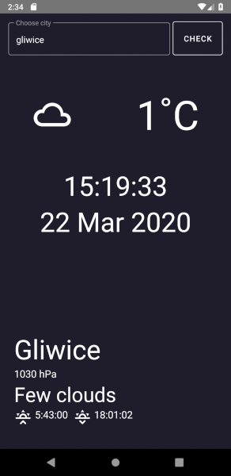

# WeatherApp

Simple app for checking the current weather wrote in React-Native version 0.61.5.
It uses free weather API from OpenWeatherMap. The application complies with the principles of Google's Material Design.
Tested only for Android.

Some components and icons were used from [React-Native-Paper](https://callstack.github.io/react-native-paper/).

App inspired by [Minimalist Weather App](https://github.com/amandeepmittal/rn-minimalist-weather-app).

Demo:

